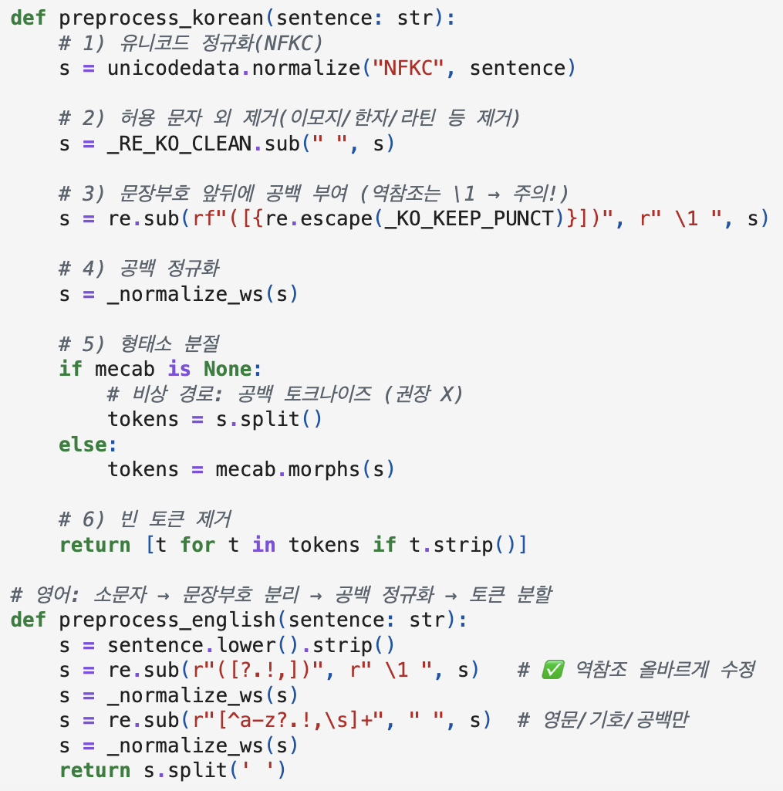
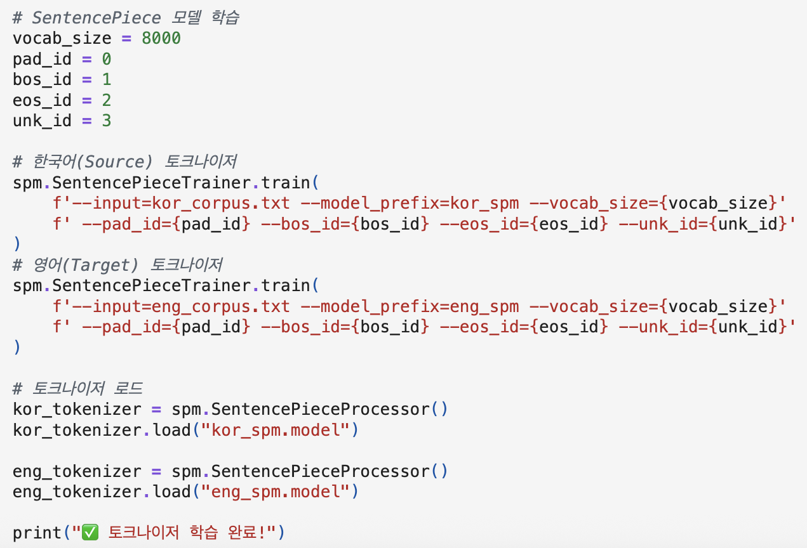
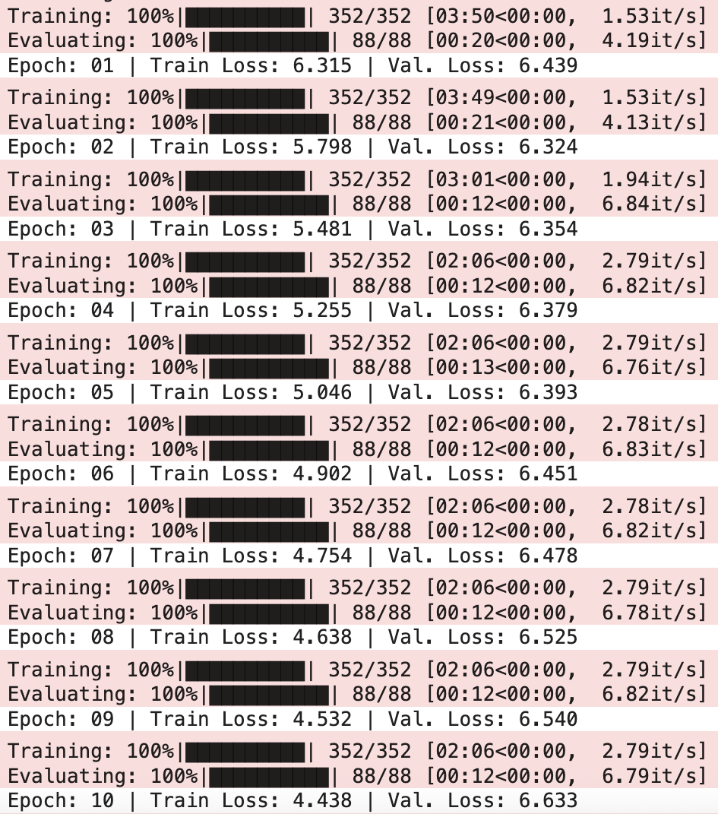
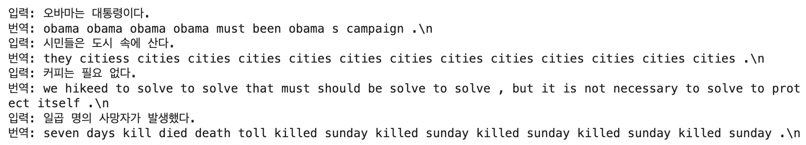
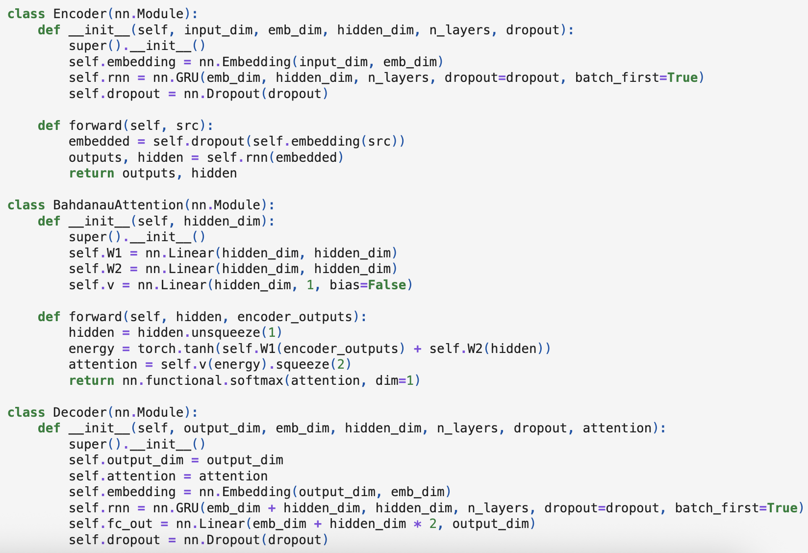
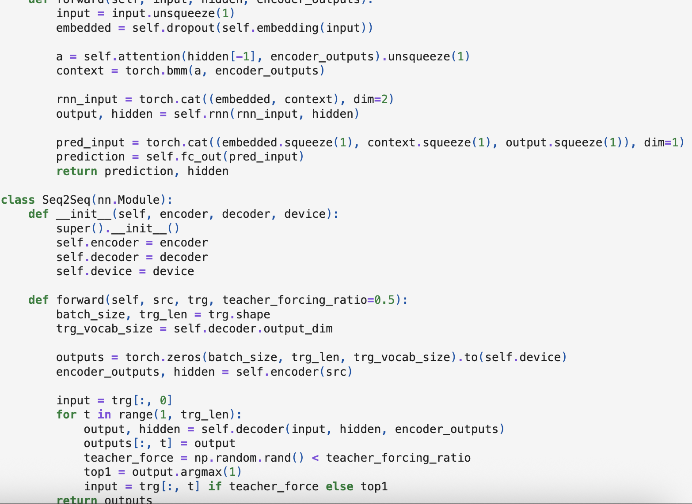
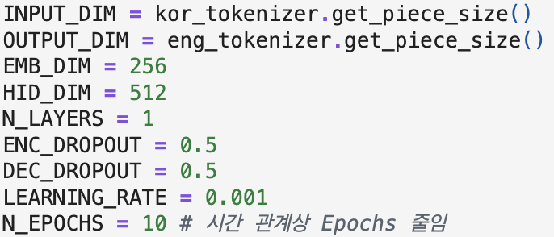

# AIFFEL Campus Online Code Peer Review Templete
- 코더 : 박진용
- 리뷰어 : 이규철


# PRT(Peer Review Template)
- [X]  **1. 주어진 문제를 해결하는 완성된 코드가 제출되었나요?**
    - 문제에서 요구하는 최종 결과물이 첨부되었는지 확인
        - 중요! 해당 조건을 만족하는 부분을 캡쳐해 근거로 첨부






한국어와 영어를 간단한 전처리를 하고 한국어는 메캡을 통해 형태소로 토크나이징을 먼저 수행하고 그 이후
한국어와 영어를 bpe를 통해 한번 더 토크나이징을 진행을 하셨습니다. 바다나우의 어텐션을 적용한
Seq2seq 모델을 사용해서 모델을 학습하고 검증하고 평가하였습니다. 한국어를 메캡을 통해 토크나이징하고
추가로 bpe로 토크나이징 한 방법이 신기했습니다. 한글을 형태소로 처리하고 bpe로 한번 더 처리하니 oov
문제에서 강건할거로 생각이 들었습니다.

- [X]  **2. 전체 코드에서 가장 핵심적이거나 가장 복잡하고 이해하기 어려운 부분에 작성된
주석 또는 doc string을 보고 해당 코드가 잘 이해되었나요?**
    - 해당 코드 블럭을 왜 핵심적이라고 생각하는지 확인
    - 해당 코드 블럭에 doc string/annotation이 달려 있는지 확인
    - 해당 코드의 기능, 존재 이유, 작동 원리 등을 기술했는지 확인
    - 주석을 보고 코드 이해가 잘 되었는지 확인
        - 중요! 잘 작성되었다고 생각되는 부분을 캡쳐해 근거로 첨부





바다나우 어텐션을 적용한 seq2seq를 구현한 코드입니다. 모델 구현히 충실히 되어있었고 정상적으로 작동하여 
학습과 검증 및 평가를 수행하셨습니다. 

- [X]  **3. 에러가 난 부분을 디버깅하여 문제를 해결한 기록을 남겼거나
새로운 시도 또는 추가 실험을 수행해봤나요?**
    - 문제 원인 및 해결 과정을 잘 기록하였는지 확인
    - 프로젝트 평가 기준에 더해 추가적으로 수행한 나만의 시도,
    실험이 기록되어 있는지 확인
        - 중요! 잘 작성되었다고 생각되는 부분을 캡쳐해 근거로 첨부

어텐션 히트맵을 시각화를 진행할 때 한글이 보이지 않는 이슈가 해결이 되지 않았어서 다시 시도해본다고 하셨습니다.
한글과 영어 둘다 보이지 않아서 어떤게 어텐션됐는지는 확인이 불가능했습니다.

- [X]  **4. 회고를 잘 작성했나요?**
    - 주어진 문제를 해결하는 완성된 코드 내지 프로젝트 결과물에 대해
    배운점과 아쉬운점, 느낀점 등이 기록되어 있는지 확인
    - 전체 코드 실행 플로우를 그래프로 그려서 이해를 돕고 있는지 확인
        - 중요! 잘 작성되었다고 생각되는 부분을 캡쳐해 근거로 첨부

회고는 따로 작성하지 않았지만 말로 설명해주셨습니다.
        
- [X]  **5. 코드가 간결하고 효율적인가요?**
    - 파이썬 스타일 가이드 (PEP8) 를 준수하였는지 확인
    - 코드 중복을 최소화하고 범용적으로 사용할 수 있도록 함수화/모듈화했는지 확인
        - 중요! 잘 작성되었다고 생각되는 부분을 캡쳐해 근거로 첨부

코드가 노드의 양식에 맞게 잘 작성되었습니다. 마지막에 로스커브 시각화로 비교하는게 보기 좋았습니다.

# 회고(참고 링크 및 코드 개선)
```
# 리뷰어의 회고를 작성합니다.
# 코드 리뷰 시 참고한 링크가 있다면 링크와 간략한 설명을 첨부합니다.
# 코드 리뷰를 통해 개선한 코드가 있다면 코드와 간략한 설명을 첨부합니다.

시간이 많이 부족해서 원래 생각했던 seq2seq를 베이스라인으로 잡고 seq2seq에 두 가지 어텐션 기법을 적용한 총 세 가지 모델을 비교하는 과정을 수행하지
못해서 상당히 아쉬웠습니다. 마지막에 BLEU 스코어도 아직 이 메트릭 자체에 이해가 높지가 않아 일부로 적용하지 않고 순수하게 로스로 평가를 했습니다.
단어사전을 정말 잘 구축해야하는게 한국어에서 mecab만으로 형태소 분석을 통한 단어사전 구축은 oov문제가 너무 심하다는걸 느꼈습니다. mecab을 이용해 
형태소 분석으로 토크나이징을 하고 bpe를 한번 더 적용하는 방식을 저도 한번 사용해봐야겠습니다.
```

